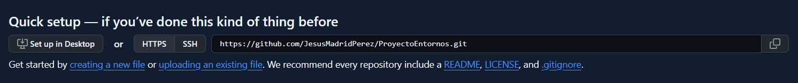
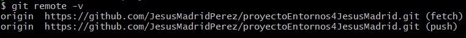

## Uso de comandos git.
### En este apartado aprenderemos a usar git

En primer lugar hay que resaltar que para hacer uso de git primero hay que instalarlo, 
si estas usando linux solo tienes que escribir en la consola de comandos
`sudo apt install git`, en windows es recomendable descargarlo en [la pagina oficial de
git](https://git-scm.com/downloads/win)

### Configuracion inicial

Una vez instalado git deberas realizar la configuracion inicial del mismo.
  
```bash
git config --global user.email          "corre@example.com"         
git config --global user.name           "Tu nombre y apellidos"
git config --global core.editor         nano
git config --global init.defaultBranch  main
```

- La primera linea se utiliza para configurar tu correo electronico
- La segunda linea para configurar tu nombre de usuario
- La tercera para definir cual sera el editor de texto por defecto en este caso nano
- Y la ultima se utiliza para definir la rama principal en la que se trabajara,
  en este caso usaremos la rama main como rama principal ya que es la que utiliza github

### Creacion de un proyecto

Ahora que git esta configurado podemos empezar a utilizarlo, para ello lo primero que 
haremos sera crear una carpeta en la que inizializaremos nuestro primer proyecto

```bash
mkdir miPrimerProyecto
cd miPrimerProyecto
```
Para inizializar el proyecto es muy sencillo solo hay que usar el comando `git init` 
que creara una carpeta oculta en nuestro proyecto llamada .git

Una vez inicializado el proyecto lo mas recomendable seria crear un archivo README.md
ya que la mayoria de los repositorios de git tienen uno `nano README.md` en el deberas
escribir informacion sobre de que trata tu repositorio

### Registro de commits

Antes de realizar nuestro primer commit es nesesario resaltar que git se dive a groso 
modo en 3 espacios el primero el directorio de trabajo que es en el que estamos ahora
y donde se realizan cambios, el segundo es el area de preparacion que es donde indica
que archivos deben de guardarse sus cambios en el repositorio y por ultimo el 
repositorio donde se guardan todos los commits y sus cambios.


 
1. añadimos un archivo al area de preparacion
```
git add README.md
``` 
2. Añadimos al repositorio
```bash
git commit -m "Primer commit"
```
Si añadimos modificamos mas de un archivo en un solo commit y no sabemos si los hemos 
añadido todos al area de preparacion podremos usar el comando `git status` para 
comprobar si se han añadido o no las modificaciones, apareciendo en verde si si se 
añadieron o en rojo si no


### Como ver los cambios realizados

Para ello solo hay que usar uno de estos comandos
~~~bash
git log
git log --oneline
git log --oneline --all

~~~
- El primero se usa para obtener informacion detallada de los commits
- El segundo se usa para obtener informacion en una sola linea 
- El tercero se usa para ver todos los commits de todas las ramas

### Como movernos a un commit anterior

Para ello se usa el comando

~~~bash
git checkout 88d2
~~~

El numero del final corresponde con el hash del commit, en tu caso pon el hash de tu commit


Una vez estas en un commit anterior es importante que no modifiques nada, pero si puedes ver
lo que has realizado anteriormente, si modificas algo en un commit podria surgir un conflicto

### Como etiquetar commits

Las etiquetas pueden ser muy utiles porque gracias a ellas podemos hacer referencia a un commit
 sin nesesidad de llamar al hash de dicho commit
~~~bash
git tag -a nombreEtiqueta -m "mensaje" commitAEtiquetar
~~~

### Como ver los cambios introducidos respecto al commit anterior

~~~bash
git show
~~~

### Como ver las diferencias entre varios commits

~~~bash
git diff v1..v2
~~~

### Como subir todos nuestros commit a GitHub

1. Crear un repositorio vacio, completamente vacio y preferiblemente con el mismo nombre
 	que el repositorio local
2. Deberas elegir como quieres asociar tu repositorio local a GitHub si mediante HTTPS o SSH
 en este caso elegiremos HTTPS



3. Asociar el repositorio local a GitHub
	Para ello usaremos `git remote add origin https://github.com/JesusMadridPerez/proyectoEntornos4JesusMadrid/tree/main`
	cambia la direccion https por la de tu repositorio
4. Comprobar si se ha asociado correctamente
`git remote -v`



5. Subir todos los commits al repositorio local
`git push -u origin main`
6. Por ultimo deberas de exportar al proyecto remoto las etiquetas
`git push --tags`

### Como deshacer cambios en el repositorio local

Si por error has borrado algo que no tenias que borrar no te preocupes si tienes commits anteriores se puede solucionar
Hay dos posibilidades:
	- Si no has creado otro commit despues del error independientemente de que hayas o no hecho git add 
		Debes usar el comando `git reset --hard` que borrara todo lo que se haya realizado despues
		del ultimo commit
	- Si has hecho un commit despues del error debes de usar el comando `git reset --hard~n` cambiando n por el numero
		de commits hacia atras que quieres regresar

### Archivo .gitignore

Git tiene un archivo que se usa para conocer que tipos de archivos no deven incluirse en el repositorio remoto, por ejemplo
los archivos ejecutables o archivos comprimidos no deben incluirse salvo contadas excepciones porque pesan demasiado, en 
java tampoco deben de incluirse los archivos .jar  o los .class que son clases compiladas en la maquina virtual de java.
Cada lenguaje de progranacion tiene archivos que no se deben incluir, pero la gran mayoria se insertan en el archivo 
'.gitignored' de la siguiente forma

~~~
*.ExtensionArchivo
~~~bash

ejemplo

~~~bash
*.exe
~~~

El archivo .gitignored debe de escribir asi sin incluir ninguna extension adicional

### Generacion de claves ssh para conectar nuestro repositorio a github

Si has estado atento recordaras como en un apartado anterior se menciono que se podia unir nuestro repositorio local a GitHub
de dos formas mediante HTTPS o SSH, se explico como hacerlo con HTTPS pero no se explico como unirlo mediante SSH, ahora es 
el momento de explicar como unirlo mediante SSH

#### ¿Porque deberia de unirlo mediante SSH?

Por un motivo muy simple si unimos nuestro repositorio mediante HTTPS tendremos que introducir nuestro ususario y contraseña
cada vez que hagamos `git push`

1. En primer lugar deberemos de crear un par de claves SSH en nuestro ordenador
Para ello solo tendremos que usar el comando 
`ssh-keygen`

Pulsamos todo a intro salvo que ya hayamos creado un par de claves anteriormente.En ese caso nos preguntará si deseamos
 sobreescribir (Override (y/n)? ) pulsamos y.

Si todo ha salido bien se nos creara un par de archivos en la carpeta ~/.ssh

	- id_rsa
	- id_rsa.pub

Siendo el primero la clave privada y el segundo la clave publica.

A continuación copia la clave publica en un archivo de texto


2. Añadimos la clave publica a github

Para ello entramos en nuestra cuenta de GitHub y en el menu general seleccionamos la opcion settings

Luego elegimos la opcion SSH y GPG keys


Buscamos el boton New SSH key y lo pulsamos

Luego deberemos de ponerle un nombre a la clave y copiar la clava publica 

3. Obtener URL SSH del repositorio

Pulsar Botón Clone or download, Use SSH

Copiamos URL en formato SSH. Su formato es relativamente fácil de memorizar. Siempre git@githbub.com seguido de dos puntos : 
y luego el nombre de usuario / nombre de repositorio.

4. Asociar nuestro repositorio local a GitHub

Para ello deberemos dar de baja nuestro repositorio remoto, puesto que estaba unido mediante HTTPS
~~~bash
git  remote  remove  origin
git  remote  add  origin   git@github.com: tu_usuario/tu_repositorio
~~~

Ahora es recomendable que hayas un nuevo commit y compruebes si te pide o no tus datos de usuario


### Como resolver conflictos

Los conflictos se producen cuando se ha hecho un cambio tanto en el repositorio remoto como en el local de la misma linea
Por ejemplo modificar una fecha en el repositorio remoto, hacer commit y modificarla tambien en el repositorio local y hacer commit

En este caso si hacemos `git push` nos dira que debemos actualizar el contenido de nuestro repositorio local con el del 
remoto, si se han realizado cambios en el repositorio remoto se deberan de actualizar los datos mediante
`git pull`

para bajar los commits del repositorio remoto que no esten en el local 

Una vez aqui se produce un conflicto puesto que se habia modificado la misma linea tanto en el repositorio local como remoto 
y se hizo commit en ambos.

Para erreglarlo debes abrir el archivo modificado, aqui veremos lineas como
- `<<<<<<<` linea o lineasen commit local
- `=======` linea o lineas en commit remoto

Para resolver el conflicto debemos de elegir entre una de las dos opciones si las lineas del repositorio local o el remoto,
o borrar las dos y escribir una linea nueva.Guardamos y hacemos un nuevo commit

y hacemos `git push` para subir los cambios


