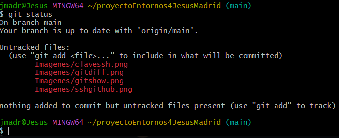
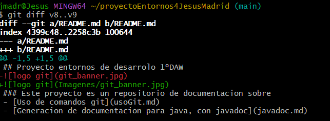

## Uso de comandos git.
En este apartado aprenderemos a usar git

### Índice
1.  [Instalar GitHub](#1-instalar-github)
2.  [Configuración inicial](#2-configuración-inicial)
3.  [Creación de un proyecto](#3-creación-de-un-proyecto)
4.  [Registro de commits](#4-registro-de-commits)
5.  [Como ver los cambios realizados](#5-como-ver-los-cambios-realizados)
6.  [Cómo movernos a un commit anterior](#6-cómo-movernos-a-un-commit-anterior)
7.  [Como subir todos nuestros commit a GitHub](#7-como-subir-todos-nuestros-commit-a-github)
8.  [Cómo deshacer cambios en el repositorio  local](#8-cómo-deshacer-cambios-en-el-repositorio-local)
9.  [Archivo .gitignore](#9-archivo-gitignore)
10. [Generación de claves ssh para conectar nuestro repositorio a github](#10-generación-de-claves-ssh-para-conectar-nuestro-repositorio-a-github)
11. [Cómo resolver conflictos](#11-cómo-resolver-conflictos)
12. [Creación de ramas](#12-creación-de-ramas)
13. [Fusión de ramas](#13-fusión-de-ramas)
14. [Eliminar ramas](#14-eliminar-ramas)
15. [Como ver las ramas creadas en GitHub](#15-como-ver-las-ramas-creadas-en-github)

### 1. Instalar GitHub
En primer lugar hay que resaltar que para hacer uso de git primero hay que instalarlo, 
si estás usando linux solo tienes que escribir en la consola de comandos
`sudo apt install git`, en windows es recomendable descargarlo en [la página oficial de git](https://git-scm.com/downloads/win)

### 2. Configuración inicial

Una vez instalado git deberás realizar la configuración inicial del mismo.
  
```bash
git config --global user.email          "corre@example.com"         
git config --global user.name           "Tu nombre y apellidos"
git config --global core.editor         nano
git config --global init.defaultBranch  main
```

- La primera línea se utiliza para configurar tu correo electrónico
- La segunda línea para configurar tu nombre de usuario
- La tercera para definir cuál será el editor de texto por defecto en este caso nano
- Y la última se utiliza para definir la rama principal en la que se trabajara,
  en este caso usaremos la rama main como rama principal ya que es la que utiliza github

### 3. Creación de un proyecto

Ahora que git está configurado podemos empezar a utilizarlo, para ello lo primero que 
haremos sera crear una carpeta en la que inicializamos nuestro primer proyecto

```bash
mkdir miPrimerProyecto
cd miPrimerProyecto
```
Para inicializar el proyecto es muy sencillo solo hay que usar el comando `git init` 
que creara una carpeta oculta en nuestro proyecto llamada .git

Una vez inicializado el proyecto lo mas recomendable seria crear un archivo README.md
ya que la mayoría de los repositorios de git tienen uno `nano README.md` en el deberás
escribir información sobre de qué trata tu repositorio

### 4. Registro de commits

Antes de realizar nuestro primer commit es necesario resaltar que git se divide a groso 
modo en 3 espacios el primero el directorio de trabajo que es en el que estamos ahora
y donde se realizan cambios, el segundo es el área de preparación que es donde indica
que archivos deben de guardarse sus cambios en el repositorio y por último el 
repositorio donde se guardan todos los commits y sus cambios.


 
1. añadimos un archivo al área de preparación
```
git add README.md
``` 
2. Añadimos al repositorio
```bash
git commit -m "Primer commit"
```
Si añadimos modificamos mas de un archivo en un solo commit y no sabemos si los hemos 
añadido todos al area de preparacion podremos usar el comando `git status` para 
comprobar si se han añadido o no las modificaciones, apareciendo en verde si si se 
añadieron o en rojo si no



Diagrama básico sobre las áreas de git


### 5. Como ver los cambios realizados

Para ello solo hay que usar uno de estos comandos
~~~bash
git log
git log --oneline
git log --oneline --all

~~~
- El primero se usa para obtener información detallada de los commits
- El segundo se usa para obtener información en una sola línea 
- El tercero se usa para ver todos los commits de todas las ramas

### 6. Cómo movernos a un commit anterior

Para ello se usa el comando

~~~bash
git checkout 88d2
~~~

El número del final corresponde con el hash del commit, en tu caso pon el hash de tu commit


Una vez estás en un commit anterior es importante que no modifiques nada, pero si puedes ver
lo que has realizado anteriormente, si modificas algo en un commit podría surgir un conflicto

### Como etiquetar commits

Las etiquetas pueden ser muy útiles porque gracias a ellas podemos hacer referencia a un commit
 sin necesidad de llamar al hash de dicho commit
~~~bash
git tag -a nombreEtiqueta -m "mensaje" commitAEtiquetar
~~~

### Como ver los cambios introducidos respecto al commit anterior

~~~bash
git show
~~~


### Como ver las diferencias entre varios commits

~~~bash
git diff v1..v2
~~~


### 7. Como subir todos nuestros commit a GitHub

1. Crear un repositorio vacío, completamente vacío y preferiblemente con el mismo nombre
 	que el repositorio local
2. Deberas elegir como quieres asociar tu repositorio local a GitHub si mediante HTTPS o SSH
 en este caso elegiremos HTTPS


3. Asociar el repositorio local a GitHub
	Para ello usaremos `git remote add origin https://github.com/JesusMadridPerez/proyectoEntornos4JesusMadrid/tree/main`
	cambia la dirección https por la de tu repositorio
4. Comprobar si se ha asociado correctamente
`git remote -v`


5. Subir todos los commits al repositorio local
`git push -u origin main`
6. Por último deberás de exportar al proyecto remoto las etiquetas
`git push --tags`

### 8. Cómo deshacer cambios en el repositorio local

Si por error has borrado algo que no tenias que borrar no te preocupes si tienes commits anteriores se puede solucionar
Hay dos posibilidades:
	- Si no has creado otro commit después del error independientemente de que hayas o no hecho git add 
		Debes usar el comando `git reset --hard` que borrara todo lo que se haya realizado después
		del último commit
	- Si has hecho un commit después del error debes de usar el comando `git reset --hard~n` cambiando n por el número
		de commits hacia atrás que quieres regresar

### 9. Archivo .gitignore

Git tiene un archivo que se usa para conocer qué tipos de archivos no deben incluirse en el repositorio remoto, por ejemplo
los archivos ejecutables o archivos comprimidos no deben incluirse salvo contadas excepciones porque pesan demasiado, en  java tampoco deben de incluirse los archivos .jar  o los .class que son clases compiladas en la máquina virtual de java.
Cada lenguaje de programación tiene archivos que no se deben incluir, pero la gran mayoria se insertan en el archivo 
'.gitignored' de la siguiente forma

~~~
*.ExtensionArchivo
~~~bash

ejemplo

~~~bash
*.exe
~~~

El archivo .gitignored debe de escribir así sin incluir ninguna extensión adicional

### 10. Generación de claves ssh para conectar nuestro repositorio a github

Si has estado atento recordarás como en un apartado anterior se mencionó que se podía unir nuestro repositorio local a GitHub
de dos formas mediante HTTPS o SSH, se explico como hacerlo con HTTPS pero no se explico como unirlo mediante SSH, ahora es 
el momento de explicar cómo unirlo mediante SSH

#### ¿Por qué debería de unirlo mediante SSH?

Por un motivo muy simple si unimos nuestro repositorio mediante HTTPS tendremos que introducir nuestro usuario y contraseña
cada vez que hagamos `git push`

1. En primer lugar deberemos de crear un par de claves SSH en nuestro ordenador
Para ello solo tendremos que usar el comando 
`ssh-keygen`


Si todo ha salido bien se nos creara un par de archivos en la carpeta ~/.ssh)
Pulsamos todo a intro salvo que ya hayamos creado un par de claves anteriormente.En ese caso nos preguntará si deseamos
 sobreescribir (Override (y/n)? ) pulsamos y.

Si todo ha salido bien se nos creara un par de archivos en la carpeta ~/.ssh

	- id_rsa
	- id_rsa.pub

Siendo el primero la clave privada y el segundo la clave pública.

A continuación copia la clave pública en un archivo de texto


2. Añadimos la clave pública a github

Para ello entramos en nuestra cuenta de GitHub y en el menú general seleccionamos la opción settings

Luego elegimos la opción SSH y GPG keys


Buscamos el botón New SSH key y lo pulsamos

Luego deberemos de ponerle un nombre a la clave y copiar la clave pública 

3. Obtener URL SSH del repositorio

Pulsar Botón Clone or download, Use SSH

Copiamos URL en formato SSH. Su formato es relativamente fácil de memorizar. Siempre git@githbub.com seguido de dos puntos : 
y luego el nombre de usuario / nombre de repositorio.

4. Asociar nuestro repositorio local a GitHub

Para ello deberemos dar de baja nuestro repositorio remoto, puesto que estaba unido mediante HTTPS
~~~bash
git  remote  remove  origin
git  remote  add  origin   git@github.com: tu_usuario/tu_repositorio
~~~

Ahora es recomendable que hayas un nuevo commit y compruebes si te pide o no tus datos de usuario


### 11. Cómo resolver conflictos

Los conflictos se producen cuando se ha hecho un cambio tanto en el repositorio remoto como en el local de la misma línea
Por ejemplo modificar una fecha en el repositorio remoto, hacer commit y modificarla también en el repositorio local y hacer commit

En este caso si hacemos `git push` nos dirá que debemos actualizar el contenido de nuestro repositorio local con el del 
remoto, si se han realizado cambios en el repositorio remoto se deberán de actualizar los datos mediante
`git pull`

para bajar los commits del repositorio remoto que no estén en el local 

Una vez aquí se produce un conflicto puesto que se había modificado la misma línea tanto en el repositorio local como remoto 
y se hizo commit en ambos.

Para arreglarlo debes abrir el archivo modificado, aquí veremos líneas como
- `<<<<<<<` linea o lineas en commit local
- `=======` linea o lineas en commit remoto

Para resolver el conflicto debemos de elegir entre una de las dos opciones si las líneas del repositorio local o el remoto,
o borrar las dos y escribir una línea nueva.Guardamos y hacemos un nuevo commit

y hacemos `git push` para subir los cambios


### 12. Creación de ramas

#### ¿Qué son las ramas de git?

Las ramas son copias de un commit, generalmente el último de la rama principal. En estas ramas se pueden hacer cambios sin
afectar a la rama principal y posteriormente integrar dichos cambios en la rama principal si lo vemos conveniente

#### ¿Cómo crear las ramas?

Se puede hacer de dos formas

- `git checkout -b` `nueva rama`
- `git branch` `nueva rama` y luego `git checkout` `nueva rama`

La diferencia principal entre las dos formas es que con la primera nos movemos a la rama recién creada y con la segunda no

Después de crear la rama es recomendable usar `git log --oneline --all --graph` para ver de forma grafica las ramas

#### 1. Creación de ramas con git checkout -b

- `git checkout -b  nueva-rama` de esta forma creamos una nueva rama a partir del commit actual y nos pasamos a ella
- `git checkout -b  nueva-rama  commit-de-partida` de esta forma creamos una nueva rama a partir del commit especificado
	y nos pasamos a ella

#### 2. Crear ramas con git branch

- `git branch  nueva-rama` Creamos una nueva rama a partir del commit actual sin pasarnos a ella
- `git branch  nueva-rama  commit-de-partida` Creamos una nueva rama a partir de la actual sin pasarnos a ella

#### 3. Pasar las ramas a GitHub

Para ello usaremos `git push origin --all` para pasar todos los commit de todas las ramas a GitHub

### 13. Fusión de ramas

1. En primer lugar para fusionar una rama con la rama main deberemos de hacer `git checkout` main si no estamos seguros de sí 
estamos o no en la rama main`.

2. Comprobamos la estructura de las ramas con `git log --oneline --all --graph`

3. Usamos el comando **`git merge`** *`rama_a_fusionar`* con esto fusionamos todos los commit de la rama a la rama main

### 14. Eliminar ramas

Si queremos eliminar una rama que no se haya fusionado con la rama main deberemos de usar **`git branch -D`** *`rama`*

### Eliminar referencias a ramas

Para ello usaremos el comando **`git branch -d `** *`rama`*

### 15. Como ver las ramas creadas en GitHub

Podremos verlas en **Insights**, **Network**


